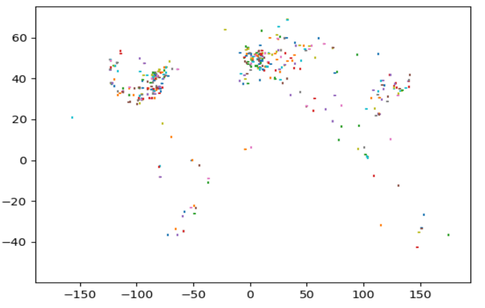

# Coverage Control Dataset Derived from Real-World City Semantic Data

This repository holds dataset(s) for the multi-agent coverage control problem. These datasets are derived from real-world semantic information from cities around the globe. We provide two types of data: sets of points representing features (points) and sets of Importance Density Functions (IDFs) derived from these points by placing a Gaussian distribution at each point.

These datasets are created as follows:
1. We use the [NASA GRUMPv1](https://sedac.ciesin.columbia.edu/data/set/grump-v1-national-admin-boundaries) dataset to identify polygon boundaries of cities with populations larger than 50,000 people worldwide. 
2. We sample 1 km^2 regions that lie completely within these city boundaries, creating a set of regions that looks like this: 

3. TODO
